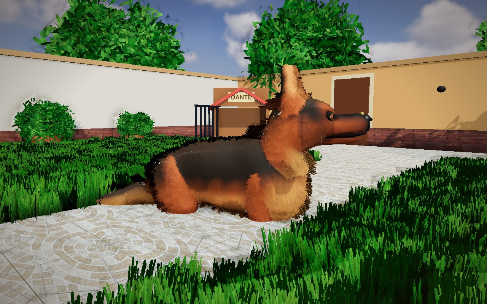
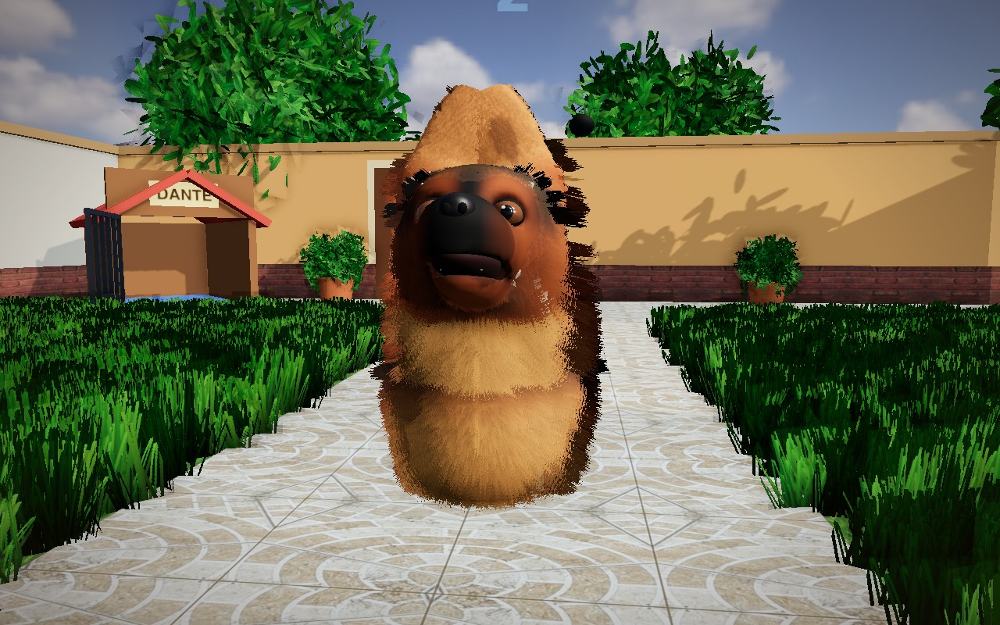
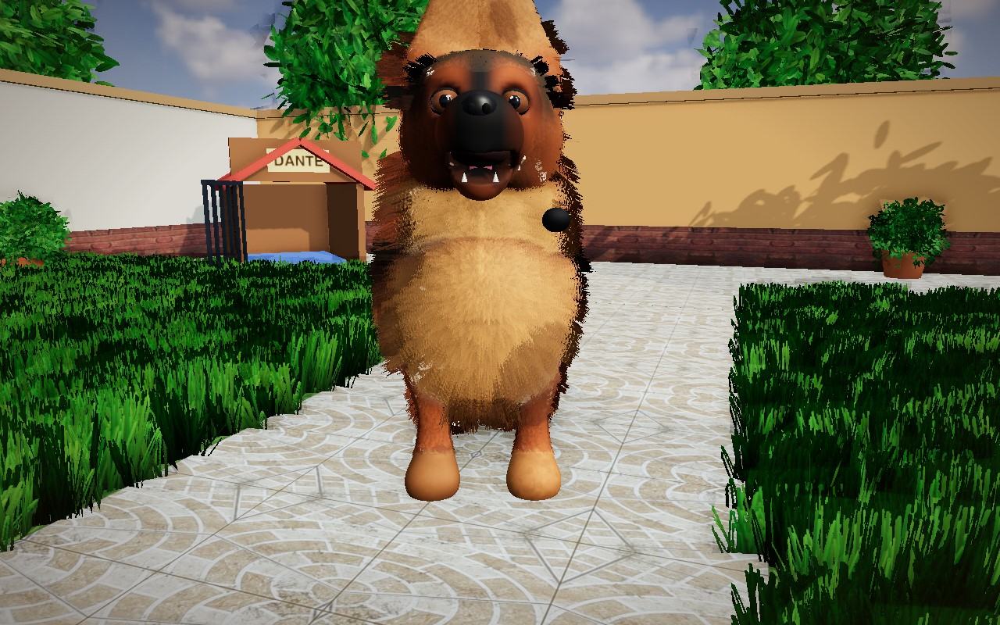
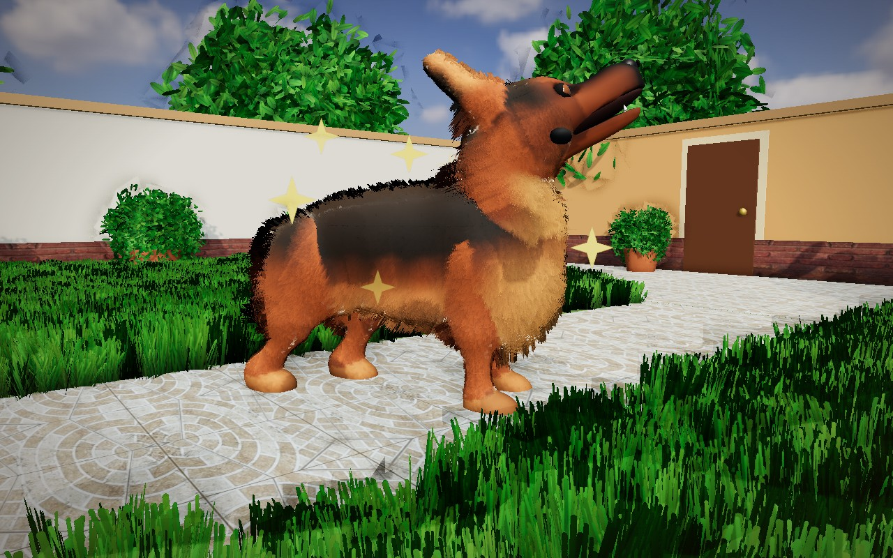
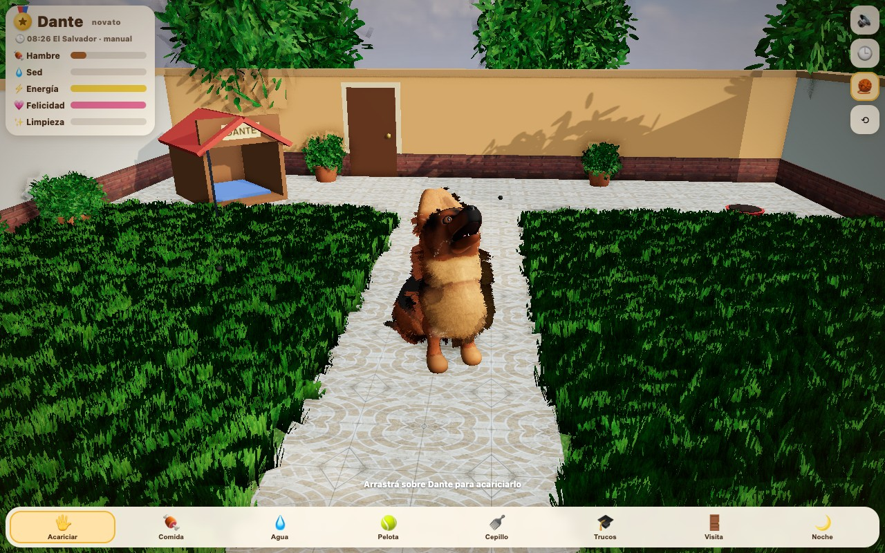
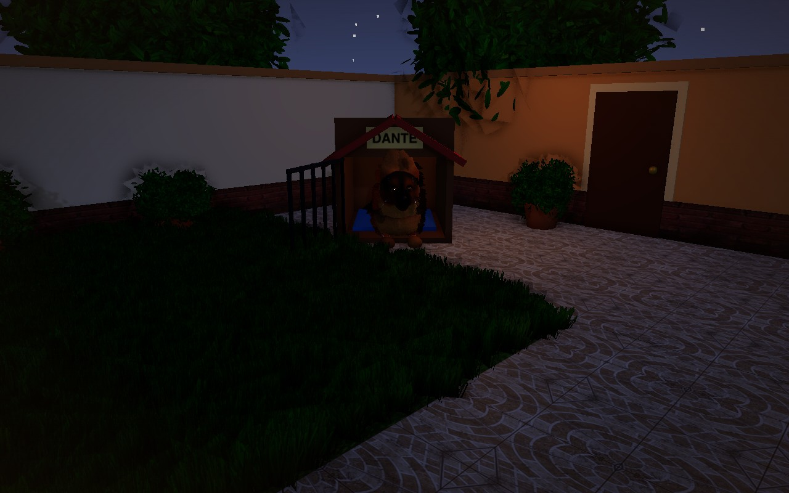

# Hasta dónde llegamos con Three.js puro

Estado del proyecto al 23 de septiembre de 2026. Todo lo que se ve acá sale de código: no hay modelos 3D externos. Las únicas "fotos" que entran son recortes de las fotos de Dante y de su patio, usadas como textura.

## Capturas

| | |
|---|---|
|  Perfil: manto negro, fuego, melena y calzones |  De frente: máscara, cejas, ojos almendrados |
|  Sit con lengua afuera |  Pose de show (stack) |
|  El patio con la interfaz |  Noche en el kennel |

## Qué se logró solo con código

- **Perro generado por campo de distancia**: unas 70 elipsoides y cápsulas colgadas de 23 huesos, fundidas con unión suave, talladas (boca, cuencas) y extraídas con un marching cubes propio. 33 mil vértices en 0.4 s.
- **Skinning y colores calculados a mano**: pesos por hueso según la distancia a cada primitiva; patrón del pelaje pintado por función en el espacio de cada hueso, afinado contra las fotos.
- **Anatomía de pastor alemán**: cruz alta, lomo inclinado, pecho profundo, patas traseras anguladas con pies que pisan planos, cabeza en cuña con stop, hocico largo con belfos, pómulos, arcos de cejas.
- **Cara**: ojos que se colocan solos sobre la superficie real, casi sin blanco, párpados que envuelven y parpadean, iris y pupila, brillo, nariz con fosas, colmillos, lengua.
- **Pelo**: 10 capas (shells) con shader propio que desplaza después del skinning, fluye hacia atrás, cae, se arrastra al correr y se mece; detalle pasa-altos de la pechera real de Dante; brillo sheen y anisotrópico; mechones de silueta (fins) más largos en orejas, melena, pechera y cola.
- **Entorno**: cielo HDRI real rotado con la hora de El Salvador, baldosas y ladrillos del patio real, grama de matas y follaje de cartas instanciadas, oclusión ambiental en pantalla, sombra de contacto.
- **Juego completo**: estados, caricias por zona, comida y agua, pelota con física, siete trucos con entrenamiento, cepillo, visitas, noche con kennel y puerta, Kiara con IA propia, logros, reloj real, guardado.

## Dónde está el techo

De perfil se reconoce a un pastor alemán de pelo largo con los colores de Dante. De frente, la cara sigue leyéndose como estilizada: la cabeza sale de unir esferas y una cara real tiene cientos de planos sutiles que esa técnica no da. Cada ronda de ajuste de parámetros desde aquí mueve poco la aguja.

El siguiente salto es una malla esculpida o generada desde sus fotos (glTF con esqueleto). Todo lo demás (pelo, patrón, IA, patio, juego) se conserva; solo cambia la malla base.
